# Unity系CLI/MCPの再発Issue横断調査と、uCLIが避けるべき設計負債

## エグゼクティブサマリ

uCLIが先に固定すべき対策は、**編集APIを増やすことではなく、制御面を決定論化すること**でした。既存のUnity CLI / MCPで再発している問題は、編集APIの不足よりも、`compile / domain reload`、`接続 / 識別`、`transport差`、`stale state`、`失敗後の状態不明` に集中しています。CoplayDevでは、スクリプト変更後に待機 primitive がなく agent が `sleep` を積み増す問題、stdio では HTTP で見える custom tool が見えない問題、UI を開いているだけで package update check が頻発する問題が継続しています。Unity公式も、同一projectをEditorが開いたままbatchmodeで開く運用をサポートせず、batchmode の console 出力は限定的で、`-quit` が error message を隠しうると明記しています。[^coplay814][^coplay837][^coplay830][^unity-cli-manual]

uCLIはすでに、[uCLI.md](uCLI.md) にある `plan -> call`、`planToken` による drift 検知、`projectFingerprint`、物理 `UnityProjectRoot` 単位の起動排他、`requestId` 冪等、`call` の live Unity 再解決、`dangerous` の隔離といった骨格を持っています。ここで先に凍結すべき制御面は、状態識別と起動排他の分離、transport 差を public 契約へ持ち込まないこと、`timeout != 未適用` を前提にした失敗時契約、idle 時の inert 性、reload-safe な session / log / artifact 管理です。これらが曖昧なまま機能を増やすと、同じ種別の不具合が transport や runtime を変えて再発しやすくなります。[^unity-cli-manual][^qiita-unity-mcp][^ivan500]

したがって、uCLI の優先課題は「不具合への個別対処」ではなく、「Unity の状態遷移・識別・排他・失敗後状態をプロトコルとして固定する」ことにあります。以下では、その観点を既存の D1-D12 に対応づけ、uCLI で既に仕様化済みの点と、未明文化の点を切り分けます。

## 方法論

調査期間は**過去5年（2021-03-19〜2026-03-19）**を前提に、GitHub Issue/PR・Wikiを一次情報として収集し、Unity公式ドキュメントとMCP仕様（modelcontextprotocol.io）で裏取りしました。優先対象は、CoplayDev/unity-mcp、IvanMurzak/Unity-MCP、akiojin/unity-mcp-server、bigdra50/unity-cli、yucchiy/UniCli、Unity公式MCP/CLIドキュメントです。citeturn30view2turn26view1turn29view0turn19view0turn21view0turn22view0turn24view0turn34view0  

検索クエリは、再発の多い症状語（例：「Session not found」「Capabilities none」「Custom tools stdio」「domain reload timeout」「path spaces」「Editor unfocused timeout」）＋リポジトリ指定（site:github.com/ORG/REPO）で横断し、設計起因と思われるものを「契約欠落」「状態機械未表現」「同一性曖昧」「観測不足」「副作用過多」にマッピングしました。実運用の補助ソースとして、Zenn/Qiita/Note/Hatena等の導入記録・トラブルシューティング記事も参照（ただし一次情報はIssue/PR優先）しています。citeturn31view0turn31view1turn32view0turn31view3  

## 主要な再発問題カテゴリ

以下は「症状→根本原因（設計段階の不都合）→代表Issue/記事→再現条件→影響範囲」を、uCLIの“避けるべき負債パターン”として整理したものです。

**カテゴリ：Editorライフサイクル（コンパイル/ドメインリロード）を契約に昇格できていない**  
症状は「スクリプト更新後に固定sleepを入れる」「ポーリングを自力実装」「準備完了前に操作して失敗/タイムアウト」。実際に、AIがsleepに頼る問題が報告され、待機API（`wait_for_compilation`）が提案・追加されています。citeturn6view2turn3view0  
根本原因は、Unityの“再コンパイル→ドメインリロード→メインスレッド再開”という状態機械が、ツール契約として露出していないことです（「コンパイルだけでは不十分でドメインリロードが必要」とする議論もあります）。citeturn28view4  
再現条件は「.cs変更→即Play/即Query/即Test」など“直後実行”。影響範囲は**自律ループのスループット低下**（待ち時間が膨らむ）と、**フレーク（環境差で待ちが足りない/過剰）**です。citeturn6view2turn3view0  

**カテゴリ：フォーカス/メインスレッドディスパッチ依存と、モーダル/ブロック検知不備**  
症状は「Unityが非フォーカスだとコマンドがキューに溜まりタイムアウト」「リロード確認ウィンドウが出るとMCPが固まり手動クリックが必要」。フォーカス依存の回帰は、`EditorApplication.update`/`delayCall`ベースのキュー処理が原因とされ、非フォーカスでupdateが回らずタイムアウトする、と整理されています。citeturn28view1turn6view0  
Unity公式にも、バッチ/無グラフィックス時の自動化制約として「フォーカスがないと入力シミュレーションができない」といった注意があり、UI状態が自動化保証を揺らす要因になり得ます。citeturn24view0  
再現条件は「ドメインリロード後にUnityを背面にする／別アプリに移る」「Unityがリロード確認等の“人間待ち”状態になる」。影響範囲は**無人運転不能（手動介入）**と、**沈黙の待ち（タイムアウトまで原因不明）**です。citeturn28view1turn6view0  

**カテゴリ：トランスポート差（stdio/Streamable HTTP）とセッション管理・起動順序の不整合**  
症状は「Streamable HTTPでSession not found」「接続が切断・不安定」「クライアント起動順で壊れる」「クライアントがHTTP非対応でブリッジが必要」。CoplayDev側では「サーバ起動後にクライアントを起動しないとSession not foundになる」系の報告があります。citeturn6view1turn31view0  
MCP仕様上も、Streamable HTTPでは初期化で返された`Mcp-Session-Id`を以後のリクエストに付与することがMUSTで、404を受けたら再初期化（新セッション開始）がMUSTです。これをクライアント/サーバが“部分実装”すると、設計時点で「再接続・再初期化の契約」が曖昧になり再発します。citeturn34view0  
運用記事でも「HTTPはSession not foundが出やすく、stdio構成で安定した」という具体例があり、クライアント実装差が再発要因になっていることが示唆されます。citeturn31view0  
再現条件は「HTTP/stdio切替」「クライアント先行起動」「頻繁な呼び出し（エージェント系）」「HTTP非対応クライアント」。影響範囲は**接続の信頼性**と**サポートコスト**です。citeturn31view0turn34view0  

**カテゴリ：ツール発見・capability交渉・スキーマの一貫性欠如**  
症状は「接続は見えるのにToolsが0」「Capabilities: none」「カスタムツールがHTTPでは出るがstdioでは出ない」「ツール更新が反映されず再接続が必要」。Unity公式のMCPトラブルシュートも「Tools(0)はツールマニフェスト（サーバ実装）に依存」と明記しています。citeturn22view0  
CoplayDev側では、`[McpForUnityTool]`で登録したカスタムツールがstdioでは見えず、HTTPでは動く、という再現手順付き報告があります。citeturn13view0  
akiojin側では「Capabilities: none（ListToolsが空）」の根本原因として、未サポートcapabilityを空オブジェクトで宣言して一部クライアントが誤解釈する、という分析と修正が提示されています。citeturn11view0turn34view1  
再現条件は「transport変更」「カスタムツール追加直後」「ツール数が多い/クライアントに上限がある」「マニフェストやcapabilityが部分実装」。影響範囲は**AIが“できること”を誤認**し、成功/失敗を取り違える点です。citeturn22view0turn13view0turn11view0  

**カテゴリ：プロジェクト同一性・パス正規化（空白/大小/ドライブ/相対）問題**  
症状は「空白パスでクライアント生成に失敗」「検出では一致しているのに『指定rootにEditorがいない』と誤判定」「パス比較ロジックがコマンド間で不一致」。空白パス問題は、実際に「プロジェクトフォルダのスペースが原因で壊れる。クォートで回避」という形で報告されています。citeturn27search7turn28view0  
また、`list_unity_project_roots`では検出できているのに、`get_unity_editor_state`等で「Unity Editor is not running at the specified project root」となる矛盾が報告され、Windowsのパス正規化/大文字小文字/ドライブ文字等が疑われています。citeturn3view5  
IvanMurzak側でも、インストールガイドで「Unityプロジェクトパスにスペース禁止」を要件として掲げており、パス取り回しが設計負債化しやすいことが見て取れます。citeturn26view1  
再現条件は「Windowsのドライブ差/大文字小文字差」「Finder/Hub起動でCWD/PATHが異なる」「空白や括弧を含むパス」。影響範囲は**誤対象操作リスク**と**接続不能**です。citeturn3view5turn26view1  

**カテゴリ：マルチエージェント/マルチインスタンスでの競合（ポート・対象選択・冪等性）**  
症状は「複数エージェントが同一デフォルトポートを奪い合い起動失敗」「複数Unityを開くと曖昧」「busy/reloading時の扱いが一定しない」。IvanMurzakのIssueでは「別エージェントが再度サーバ起動を試みてポート衝突する」ため、エージェントごとのポート指定を求めています。citeturn26view0  
IvanMurzakのインストールガイドでは、ポートをプロジェクトパスのSHA256から決定し50000–59999にマップする“決定論”で衝突回避を狙う一方、衝突時の上書き手段も提示しています。citeturn26view1  
bigdra50/unity-cliは、Relay側で「READY/BUSY/RELOADING/DISCONNECTED」の状態や、待機/即時エラーの規則、成功レスポンスのキャッシュ（冪等性）を設計として明文化しており、競合を“契約で潰す”方向性の好例です。citeturn19view0turn36view0  
再現条件は「エージェントを複数起動」「Unityを複数」「ドメインリロード中に別要求」。影響範囲は**誤対象操作**、**実行の二重化**、**リトライ地獄**です。citeturn26view0turn19view0turn36view0  

**カテゴリ：性能・副作用（バックグラウンド処理/ファイルロック/GC/更新チェック）**  
症状は「UI操作でパッケージ更新チェックが頻発し数分固まる」「無効化していてもPlay突入が6秒+300MB GC」「ドメインリロードごとにログのSharing violationが大量に出る」。実例として、MCPウィンドウ上のマウス移動で`CheckForPackageUpdates`が走り数分待たされる報告があります。citeturn3view1  
IvanMurzak側では「サーバ無効でもPlay突入に6秒/300MB GC」といった性能苦情や、ログファイルの共有モード不整合で例外ログが毎回出る、という報告があります。citeturn3view4turn3view3  
再現条件は「UIイベント」「Play突入」「domain reload」。影響範囲は**体感速度/信頼性の低下**（“AI連携は重い/うるさい”という印象）です。citeturn3view1turn3view4turn3view3  

**カテゴリ：観測性・診断性の不足（沈黙の失敗、層の多さによる混乱、環境差）**  
症状は「Unity側は動いて見えるのにクライアントにツールが出ない」「stdioでサーバプロセスが即死してもクライアントは“繋がらない”に見える」「Unity（Hub/Finder起動）とターミナルでPATHが違い外部コマンドが見えない」。実運用記事でも、stdioでは“プロセスが落ちても分かりにくい”ことが指摘されています。citeturn31view1  
Unity公式トラブルシュートは、Unityがターミナルと異なるPATHで動くため「Executable not found in $PATH」になる、という原因と対処（Unity側PATHに追加、Inspectorで検証）を明確に述べています。citeturn22view0  
CoplayDev wikiにも、macOSのGUIアプリがシェルPATHを継承しないためUnityからclaudeが見えない、絶対パスで指定せよ、というFAQがあります。citeturn30view0  
Qiitaの実装解説では「MCPはClient↔Pythonで、裏は別TCPでUnityと繋ぐ。ユーザーがUnityとClient両方を見るので混乱の元」という“層の多さ”が明示されています。citeturn31view3  
影響範囲は**切り分け工数の増大**と、**“保証できない領域”がブラックボックス化**してAI運用のレビュー/検証が破綻する点です。citeturn22view0turn31view3turn31view1  

## 制御面から見た補助観点

ここで重要なのは、「不具合に個別対処する」ではなく、「Unity の状態遷移・識別・排他・失敗後状態をプロトコルとして固定する」ことです。以下は、既存の D1-D12 を制御面から読み直すための補助観点です。[^coplay814][^unity-cli-manual]

1. **`compile / domain reload` をプロトコル状態として扱う（対応: D1, D2, D3）**
   `sleep` や ad-hoc polling に流れる時点で API ではなく運用に待機責務が漏れています。`ready / compiling / reloading / blocked` を first-class にし、既定待機と `failFast`、`compileGeneration`、`busy`、`playmode` のような状態拡張も、その延長として扱うべきです。[^coplay814][^unity-cli-manual]

2. **物理 `UnityProjectRoot` を起動排他の第一級 identity にする（対応: D6, D7）**
   同一物理projectに対する起動排他を port や起動順の偶然に委ねると、port conflict や二重起動は症状として何度でも再発します。`daemon / oneshot / test.run` を同じ lifecycle lock に参加させることが安全側の基準です。[^unity-cli-manual]

3. **transport ごとに意味を変えず、capability で明示交渉する（対応: D4, D5）**
   stdio と HTTP で同じ server が別製品のように振る舞うと、agent は「見えていない機能」を「存在しない機能」と誤認します。差異は黙って欠落させず、transport と切り離した capability 差として表面化すべきです。[^coplay837]

4. **mutation の真実は live Unity に置き、索引やローカル情報は観測専用に寄せる（対応: D1, D3, D10）**
   stale read を避けるには、`call` が常に live Unity 実体で再解決・再検証する必要があります。readIndex やローカル cache は `query / resolve / validate` の補助に限定し、mutation の正本にしてはいけません。[^qiita-unity-mcp]

5. **safe core は generic setter ではなく typed reference / typed op に寄せる（対応: D12）**
   Unity の object reference や serialized graph は「何でも JSON で入る setter」と相性が悪く、reference-type field で破綻しやすいです。safe core は `typed op + typed reference + explicit context` に閉じ、任意コード実行は別平面へ隔離する方が筋が通ります。[^coplay816]

6. **optional module / package 依存は compile-time 前提にしない（対応: D5, D12）**
   screenshot や test 補助のような optional feature が未導入環境で compile error を起こす設計は、機能追加のたびに全体の信頼性を落とします。optional feature は capability で交渉し、「使えない理由」が機械判定できる形で出すべきです。[^coplay821]

7. **失敗時契約を最優先にし、`timeout` を「未適用」と同一視しない（対応: D9）**
   reload disconnect や IPC timeout は、未適用ではなく「状態不明」を含みえます。retry を安全にするには、`not-applied` と `indeterminate` を区別し、artifact path や editor log のような証拠を返す契約が必要です。[^unity-cli-manual]

8. **idle 時は inert にし、背景作業は明示コマンドか TTL に限定する（対応: D8）**
   Editor 常駐時に package check や index refresh が勝手に走ると、性能だけでなく `stateFingerprint` と latency の予測可能性も壊れます。idle 時の zero-ish work は safe-edit の一部です。[^coplay830]

9. **reload-safe な file / log / session 管理にする（対応: D8, D10）**
   domain reload は例外ではなく通常事象なので、長寿命 file handle 前提の設計は sharing violation や stale session を生みます。session、daemon log、artifact 書き込みは、reload generation をまたいで reopen-safe であるべきです。[^ivan500]

10. **AI 向け列挙系は bounded-by-default にする（対応: D11）**
   無制限列挙は性能最適化の問題ではなく、AI 利用側に「とりあえず list して考える」癖を固定してしまう設計負債です。`query / resolve / logs` は shallow summary、deterministic order、段階取得を既定にする方が強いです。[^qiita-unity-mcp]

## 設計負債としての定義と優先度

ここでの「設計負債」は、**実装の都合ではなく“プロトコル/契約の欠落や曖昧さ”により、同じ種別の不具合が環境・バージョン・クライアント違いで再発し続ける状態**を指します。P0/P1/P2は次の基準で付与します。

- P0: **無人運転（自律）や“正しさの保証”が崩れる**。誤対象操作・沈黙の不整合・恒常的タイムアウトを生む。
- P1: **信頼性・性能が大きく劣化**し、利用継続が難しくなる（ただし致命的誤操作までは直結しない）。
- P2: 主にUX/運用負担。回避や手順で逃げられるが、積むとコストが増える。

### 優先度付き負債一覧表

| 負債ID | 設計負債（要約） | 優先度 | 何が壊れるか | 根拠（代表ソース） |
|---|---|---|---|---|
| D1 | compile / domain reload を protocol state にせず、待機を sleep / polling に漏らしている | P0 | 再現性・スループット・自動化 | Coplay #814 / Unity Manual[^coplay814][^unity-cli-manual] |
| D2 | focus / modal / event loop stall を block reason として機械判定できない | P0 | 無人運転不能、原因不明タイムアウト | Unity Manual[^unity-cli-manual] |
| D3 | mutation 前後の状態変化を fail closed で扱えず、stale state を実行へ持ち込む | P0 | 誤適用、再試行の危険化 | Qiita 実装メモ[^qiita-unity-mcp] |
| D4 | transport 差を capability で吸収できず、意味差と接続差が混線する | P0 | 接続の信頼性、再初期化の正しさ | Coplay #837[^coplay837] |
| D5 | capability / schema / optional feature 境界が弱く、見える機能と使える機能が一致しない | P0 | AI が機能を誤認し、compile error まで波及する | Coplay #837 / #821[^coplay837][^coplay821] |
| D6 | project 同一性を `projectFingerprint` で固定せず、path や CWD 推論に依存する | P0 | 誤対象操作、接続不能 | Unity Manual[^unity-cli-manual] |
| D7 | 同一物理 project の Unity 起動排他が弱く、port conflict や二重起動を個別回避に委ねる | P0 | 同時実行で壊れる、二重起動 | Unity Manual[^unity-cli-manual] |
| D8 | idle 時も inert でなく、background work / 更新チェック / GC / file lock が常時ノイズ化する | P1 | 体感速度・信頼性・継続利用 | Coplay #830 / Ivan #500[^coplay830][^ivan500] |
| D9 | timeout / disconnect / crash 後の状態を machine-readable に返せず、`未適用` と `状態不明` を混同する | P0 | unsafe retry、診断不能 | Unity Manual[^unity-cli-manual] |
| D10 | session / log / artifact を reload-safe に扱えず、sharing violation や stale session を起こす | P1 | split-brain、リソース破綻 | Ivan #500[^ivan500] |
| D11 | AI 向け一覧・ツリー・ログが bounded-by-default でなく、全件列挙を主経路にしてしまう | P2 | AI運用コスト、失敗率 | Qiita 実装メモ[^qiita-unity-mcp] |
| D12 | safe core を typed reference / typed op で閉じず、generic setter や optional 依存が主経路へ漏れる | P2 | 半端な自動化、手作業混入 | Coplay #816 / #821[^coplay816][^coplay821] |

### uCLIで既に仕様化済みの点と、未明文化の点

| 観点 | uCLIで既に仕様化済みの点 | 未明文化の点 |
|---|---|---|
| compile / reload の drift 制御 | [uCLI.md](uCLI.md) に `planToken`、`compileState`、`domainReloadGeneration`、`failFast`、`compileGeneration`、`busy / playmode` がある | 制御面の未明文化は今回の正本化で解消 |
| project 同一性 | [uCLI.md](uCLI.md) に `projectFingerprint` による状態識別と物理 `UnityProjectRoot` 単位の起動排他がある | 制御面の未明文化は今回の正本化で解消 |
| live Unity only | [uCLI.md](uCLI.md) に「`call` は readIndex に依存せず、Unity実体で再解決・再検証して実行する」とある | mutation 後の次回 read 安全性を返す公開レスポンス契約は未整理 |
| dangerous の隔離 | [uCLI.md](uCLI.md) に `operationPolicy = safe | advanced | dangerous` と `--allowDangerous` の分離がある | safe core を `typed reference + typed op + explicit context` で閉じる規範文が弱い |
| 証拠と失敗時契約 | [uCLI.md](uCLI.md) に `timeout != 未適用` の原則がある | `indeterminate`、証拠返却、失敗補足情報の公開 field は未固定 |
| bounded 出力 | [uCLI-command-reference.md](uCLI-command-reference.md) の `ucli logs` は `cursor` ベースの段階取得を持つ | `query / resolve` を含む一覧系全体に bounded-by-default を通す規範文が未整理 |

### 負債IDと正本セクション

| 負債ID | 主な正本セクション |
|---|---|
| D1 | [uCLI.md](uCLI.md) `Editor Lifecycle` / [uCLI-command-reference.md](uCLI-command-reference.md) `--failFast` |
| D2 | [uCLI.md](uCLI.md) `Editor Lifecycle` / [uCLI-property-reference.md](uCLI-property-reference.md) `status / lifecycle` |
| D3 | [uCLI.md](uCLI.md) `planToken とドリフト検知` / `mutation 後の read 安全性` |
| D4 | 正本化対象外（調査メモのみ） |
| D5 | 正本化対象外（調査メモのみ） |
| D6 | [uCLI.md](uCLI.md) `物理 UnityProjectRoot 単位の起動排他` / `planToken とドリフト検知` |
| D7 | [uCLI.md](uCLI.md) `物理 UnityProjectRoot 単位の起動排他` |
| D8 | [uCLI-design-principles.md](uCLI-design-principles.md) / 今後の実装・運用課題 |
| D9 | [uCLI.md](uCLI.md) `公開 CLI 共通エンベロープ` / `内部 IPC 応答` / `execute 系応答の公開写像` |
| D10 | [uCLI-command-reference.md](uCLI-command-reference.md) `ucli logs`, `ucli daemon` / artifact 契約 |
| D11 | [uCLI-command-reference.md](uCLI-command-reference.md) `ucli logs` / 残課題 |
| D12 | [uCLI.md](uCLI.md) `ガード` / 残課題 |

## uCLIへの具体的回避策

uCLIはMCPではなく独自JSON契約＋IPCという前提ですが、**再発している“壊れ方”はUnity側の状態機械と観測性の問題**なので、仕様/実装/運用の三層で先回りが必要です。特にP0は「機械的に検査できる契約文」と「それを破ると必ず落ちるCIゲート」に落とすのが効きます。

### uCLI設計で直ちに追加すべき契約文

以下は「テストで機械的に検査可能」な形に寄せた、追加推奨の契約文（例）です。

1. **Editor準備完了ゲート**  
   `call` は各opの `Call` 実行前に、`lifecycleState = ready` を満たさない場合、既定では `starting / busy / compiling` の解消を待つ。`domainReloading` は AppDomain reload を跨いで要求を再開しないため待機対象にせず、`--failFast` 指定時と同様に `EDITOR_DOMAIN_RELOADING` で **1件も適用しない**。timeout は `IPC_TIMEOUT` とする。根拠として、コンパイル待ちがsleep依存になる再発と、domain reload 中の in-flight handler 消失を防ぐため。citeturn6view2turn3view0

2. **フォーカス依存の“沈黙タイムアウト”禁止**  
   デーモンはメインスレッドポンプが停止/極端に遅い状態（例：一定時間 `heartbeatTick` が進まない）を検知したら、`IPC_TIMEOUT` ではなく `EDITOR_EVENT_LOOP_STALLED` を返し、`payload.diagnosis` に「原因候補（unfocused/modal）」を符号化する（再現例あり）。citeturn28view1turn6view0  

3. **プロジェクト同一性はfingerprintで判定し、パス文字列比較を禁止**
   実行対象は `projectFingerprint` 一致で確定し、パスは表示/診断用途に限定する。差異がある場合は `PROJECT_FINGERPRINT_MISMATCH` で停止する（パス正規化差で誤判定が起きるため）。citeturn3view5turn26view1turn28view0  

4. **“人間待ちUI”の検出と明示**
   Unity側でリロード/確認などのブロックが検知された場合、`lifecycleState = blockedByModal` と `blockingReason = modalDialog` を返し、`call` は `EDITOR_MODAL_BLOCKED` で即失敗する（人間がクリックしないと進まない再発を契約で表面化）。citeturn6view0turn24view0

5. **バッチ/oneshotの排他要件を明文化**
   `--mode oneshot` は、同一プロジェクトがGUIで開かれている場合を検知したら `UNITY_PROJECT_ALREADY_OPEN` を返す（Unityは同一プロジェクトを複数インスタンスで開けない旨が明記されている）。citeturn24view0  

8. **副作用予算とノイズ上限**  
   `plan` は「永続化しない」だけでなく、`planObservations` に副作用（reimport/compile/domainReload）を必ず記録し、規定閾値を超えた場合は `PLAN_SIDE_EFFECT_TOO_HIGH` として失敗できるようにする（性能・副作用の再発を“測って止める”ため）。citeturn3view1turn3view4  

### 図表

uCLIの実体（daemon/oneshot/IPC/readIndex/planToken/requestId/session）の関係と、plan→call→save→artifactのタイムラインを、mermaidで示します（「埋め込み画像リンク」と「mermaidコード」を両方提示）。

**エンティティ関係図（画像埋め込みリンク）**  
```md
![uCLI ERD](https://mermaid.ink/img/Zmxvd2NoYXJ0IExSCiAgJSUgdUNMSSBleGVjdXRpb24gZW50aXRpZXMKICBDTElbdWNsaSBDTEkgKC5ORVQpXTo6OmNsaQogIENGR1suLi91Y2xpL2NvbmZpZy5qc29uXTo6OnN0b3JlCiAgSURYW3JlYWRJbmRleF06OjpzdG9yZQogIEtFWVtwbGFuLXRva2VuLmtleV06OjpzdG9yZQogIFNFU1tzZXNzaW9uLmpzb25dOjo6c3RvcmUKICBBUlRbYXJ0aWZhY3RzL10gOjo6c3RvcmUKCiAgc3ViZ3JhcGggTW9kZXNbRXhlY3V0aW9uIE1vZGVzXQogICAgQVVUT1ttb2RlPWF1dG9dCiAgICBEQUVNT05bbW9kZT1kYWVtb25dCiAgICBPTkVTSE9UW21vZGU9b25lc2hvdF0KICBlbmQKCiAgc3ViZ3JhcGggVW5pdHlbVW5pdHkgRWRpdG9yIHByb2Nlc3NdCiAgICBVR1VJW0dVSSBFZGl0b3IgaW5zdGFuY2VdCiAgICBVQkFUQ0hbQmF0Y2htb2RlIG9uZXNob3RdCiAgICBVU1JW[HVNsbGkuVW5pdHkgc2VydmVyIChkYWVtb24pXTo6OnNydgogICAgUVtNYWluLXRocmVhZCB3b3JrIHF1ZXVlXTo6OnNydgogIGVuZAoKICBJUENbSVBDOiBOYW1lZFBpcGUvVURTXTo6OmlwYwoKICBDTEkgLS0+IENGRwogIENMSSAtLT4gSURYCiAgQ0xJIC0tPiBNb2RlcwogIENMSSAtLT58Y29ubmVjdC9leGVjdXRlfSBJUEMKICBJUEMgPC0tPiBVU1JWCiAgVVNSViAtLT4gUQogIFEgLS0+IFVSRgoKICBVU1JWIC0tPnx3cml0ZXN8IFNFUwogIFVSRiAtLT58cmVhZHN8IENGRwogIFVSRiAtLT58dXBkYXRlc3wgSURYCiAgVVNSViAtLT58d3JpdGVzfSBBUlQKICBVU1JWIC0tPnxzaWduL3ZlcmlmeXwgS0VZCgogIEFVVE8gLS0+fGRhZW1vbiBpZiBydW5uaW5nIGVsc2Ugb25lc2hvdHwgVVNSVgogIERBRU1PTiAtLT58bXVzdCB1c2UgZGFlbW9ufCBVU1JWCiAgT05FU0hPVCAtLT58c3Bhd25zIC1iYXRjaG1vZGV8IFVCQVRDSAogIFVCQVRDSCAtLT58cnVucyBzYW1lIG9wc3wgUQoKICBjbGFzc0RlZiBjbGkgZmlsbDojZWVmLHN0cm9rZTojNjZmLGNvbG9yOiMwMDA7CiAgY2xhc3NEZWYgc3J2IGZpbGw6I2VmZSxzdHJva2U6IzZhNixjb2xvcjojMDAwOwogIGNsYXNzRGVmIGlwYyBmaWxsOiNmZmUsc3Ryb2tlOiNhYTYsY29sb3I6IzAwMDsKICBjbGFzc0RlZiBzdG9yZSBmaWxsOiNmZWYsc3Ryb2tlOiNhNmEsY29sb3I6IzAwMDsK)
```

**エンティティ関係図（mermaidコード）**  
```mermaid
flowchart LR
  %% uCLI execution entities
  CLI[ucli CLI (.NET)]:::cli
  CFG[.ucli/config.json]:::store
  IDX[readIndex]:::store
  KEY[plan-token.key]:::store
  SES[session.json]:::store
  ART[artifacts/]:::store

  subgraph Modes[Execution Modes]
    AUTO[mode=auto]
    DAEMON[mode=daemon]
    ONESHOT[mode=oneshot]
  end

  subgraph Unity[Unity Editor process]
    UGUI[GUI Editor instance]
    UBATCH[Batchmode oneshot]
    USRV[Ucli.Unity server (daemon)]:::srv
    Q[Main-thread work queue]:::srv
  end

  IPC[IPC: NamedPipe/UDS]:::ipc

  CLI --> CFG
  CLI --> IDX
  CLI --> Modes
  CLI -->|connect/execute| IPC
  IPC <--> USRV
  USRV --> Q
  Q --> USRV

  USRV -->|writes| SES
  USRV -->|reads| CFG
  USRV -->|updates| IDX
  USRV -->|writes| ART
  USRV -->|sign/verify| KEY

  AUTO -->|daemon if running else oneshot| USRV
  DAEMON -->|must use daemon| USRV
  ONESHOT -->|spawns -batchmode| UBATCH
  UBATCH -->|runs same ops| Q

  classDef cli fill:#eef,stroke:#66f,color:#000;
  classDef srv fill:#efe,stroke:#6a6,color:#000;
  classDef ipc fill:#ffe,stroke:#aa6,color:#000;
  classDef store fill:#fef,stroke:#a6a,color:#000;
```

**タイムライン図（画像埋め込みリンク）**  
```md
![uCLI timeline](https://mermaid.ink/img/c2VxdWVuY2VEaWFncmFtCiAgYXV0b251bWJlcgogIHBhcnRpY2lwYW50IENMSSBhcyB1Y2xpIChDTEkpCiAgcGFydGljaXBhbnQgU1JWIGFzIFVuaXR5IHNlcnZlciAoZGFlbW9uKQogIHBhcnRpY2lwYW50IFUgYXMgVW5pdHkgbWFpbiB0aHJlYWQKICBwYXJ0aWNpcGFudCBGUyBhcyAuL3VjbGkvbG9jYWwKCiAgTm90ZSBvdmVyIENMSSxTUlY6IHBsYW4gcGhhc2UgKG5vIHBlcnNpc3RlbmNlKQogIENMSS0+PlNSVjogcGxhbihwcm90b2NvbFZlcnNpb24sIHJlcXVlc3RJZCwgc3RlcHMpCiAgU1JWLT4+VTogVmFsaWRhdGUgKyBSZXNvbHZlICsgUGxhbiAoZmFpbC1mYXN0KQogIFUtLT4+U1JWOiBwbGFuUmVzdWx0IChkaWZmLCB0b3VjaGVkLCBvYnNlcnZhdGlvbnMpCiAgU1JWLT4+RlM6IChvcHRpb25hbCkgdXBkYXRlIHJlYWRJbmRleCBjYWNoZQogIFNSVi0tPj5DTEk6IHBsYW5Ub2tlbiArIG9wUmVzdWx0cwoKICBOb3RlIG92ZXIgQ0xJLFNSVjogY2FsbCBwaGFzZSAobWF5IHBlcnNpc3QpCiAgQ0xJLT4+U1JWOiBjYWxsKHByb3RvY29sVmVyc2lvbiwgcmVxdWVzdElkLCBzdGVwcywgcGxhblRva2VuKQogIFNSVi0+PlU6IFZhbGlkYXRlICsgUGxhbiAoYWxsIHN0ZXBzKQogIFNSVi0+PlNSVjogVmVyaWZ5IHBsYW5Ub2tlbiAoZGlnZXN0ICsgc3RhdGVGaW5nZXJwcmludCkKICBTRVItPj5VOiBBcHBseS9DYWxsIChtdXRhdGlvbnMpCiAgVS0+PlU6IGNvbW1pdCBib3VuZGFyeSAoY29udGV4dC9wcm9qZWN0KQogIFUtLT4+U1JWOiBjYWxsUmVzdWx0IChjaGFuZ2VkLCB0b3VjaGVkKQogIFNSVi0+PkZTOiB3cml0ZSBhcnRpZmFjdHMgKyBsb2dzICh0ZXN0IHJlc3VsdHMsIHN1bW1hcmllcykKICBTRVItLT4+Q0xJOiBKU09OIHJlc3BvbnNlIChzdGF0dXMsIGV4aXRDb2RlLCBlcnJvcnMpCg)
```

**タイムライン図（mermaidコード）**  

```mermaid
sequenceDiagram
  autonumber
  participant CLI as ucli (CLI)
  participant SRV as Unity server (daemon)
  participant U as Unity main thread
  participant FS as .ucli/local

  Note over CLI,SRV: plan phase (no persistence)
  CLI->>SRV: plan(protocolVersion, requestId, steps)
  SRV->>U: Validate + Resolve + Plan (fail-fast)
  U-->>SRV: planResult (diff, touched, observations)
  SRV->>FS: (optional) update readIndex cache
  SRV-->>CLI: planToken + opResults

  Note over CLI,SRV: call phase (may persist)
  CLI->>SRV: call(protocolVersion, requestId, steps, planToken)
  SRV->>U: Validate + Plan (all steps)
  SRV->>SRV: Verify planToken (digest + stateFingerprint)
  SRV->>U: Apply/Call (mutations)
  U->>U: commit boundary (context/project)
  U-->>SRV: callResult (changed, touched)
  SRV->>FS: write artifacts + logs (test results, summaries)
  SRV-->>CLI: JSON response (status, exitCode, errors)
```


## 推奨する検証メトリクスとテスト

保証（assurance）に寄せるには、「再発カテゴリ」を**テストで落とせる“不変条件”**に変換し、CIでゲートするのが近道です。参考として、MCP仕様のstdioでは「stdoutに非プロトコル文字列を出してはいけない」「stderrはログ用」という規約が明記されています（uCLIのstdout=JSON1件契約はこの系統の“機械可読性”を強化する）。citeturn34view0  

### 自動化可能なチェックリスト

- **契約整合**: `validate/plan/call`の入出力JSONがスキーマ準拠し、`protocolVersion`不一致で必ず処理を実行せず落ちる（互換性破壊を検知）。citeturn34view1  
- **Editor状態ゲート**: `call` は `starting / busy / compiling` の間だけ既定待機し、`domainReloading` では“1件も適用せず”に `EDITOR_DOMAIN_RELOADING` を返す。`--failFast` 指定時は wait 対象状態も即失敗に反転する。待機 timeout は `IPC_TIMEOUT` を返す（sleep依存の再発を防止）。citeturn6view2turn3view0
- **フォーカス/ポンプ停止診断**: Unity非フォーカス・モーダル時に、単なるタイムアウトにせず`EDITOR_EVENT_LOOP_STALLED` / `EDITOR_MODAL_BLOCKED` を返す（原因が分かる）。citeturn28view1turn6view0
- **パス同一性**: 同一プロジェクトでも表記揺れ（大小/終端/相対）でfingerprintが変わらない、または変わるなら“必ず拒否”する。citeturn3view5turn26view1  
- **性能予算**: 代表オペレーションのp95時間・GC/アロケーション・エディタ固まり（UIイベント爆発）を測り、閾値超過で落とす（更新チェック地獄等を封じる）。citeturn3view1turn3view4  
- **リソース健全性**: ドメインリロードを繰り返してもログファイル共有違反などが発生しない（ファイルハンドルリーク）。citeturn3view3  

### CI gateルール例

- `SchemaGate`: すべてのコマンドレスポンスが **stdoutにJSON1件のみ**、診断はstderr、をスナップショットで検証（MCPのstdio規約と同型）。citeturn34view0  
- `DeterminismGate`: `planToken`の`requestDigest`生成が「フィールド順・空白・改行差」に影響されない（**プロパティテスト**でJSON正規化をfuzz）。  
- `StateGate`: “compile→call”や“domain reload→call”のシナリオE2Eで、**適用ゼロを保証**して落ちる（D1/D2/D3をP0で潰す）。citeturn28view1turn6view2  
- `TransportInvarianceGate`: （uCLI内部IPCの話だとしても）“実行経路の違いで機能欠落が起きない”ことを、daemon/oneshotの両経路で同一golden testを流して検証。citeturn13view0  

### fuzz / property / mutation の適用箇所

- **fuzz（入力耐性）**: `--timeout`等の数値引数、`protocolVersion`、`ops[].args`（スキーマ検証境界）。Unity公式でも「UnityとターミナルでPATHが違う」「実行コマンドが一致しているか」等、環境差が失敗要因とされるため、入力・環境の揺れを前提に壊れ方を固定化すると良いです。citeturn22view0turn30view0  
- **property（不変条件）**: `requestDigest`の正規化同値性、`stateFingerprint`の単調性、`requestId`冪等（同一ID同一内容は同一応答、異内容は衝突）。競合制御や冪等が設計として重要であることは、他CLIの設計でも強調されています。citeturn19view0turn36view0  
- **mutation（テストの効き）**: `planToken`検証順序（署名/期限/一致/状態）や、`fail-fast`で“Callを一切しない”保証部分にミューテーションを当て、テストが落ちることを確認（保証ロジックはバグると高リスク）。  
- **長時間・回帰**: “UIイベント連打”“Play突入”“domain reload連打”の回帰ベンチ（更新チェック頻発やGC肥大の再発検知）。citeturn3view1turn3view4turn35search7  

## 代表的Issueの短い抜粋とリンク

「抜粋」は25語制限に収まる短文にし、リンクは引用（citation）で示します。

| 事例 | 短い抜粋 | 何が設計起因か |
|---|---|---|
| Coplay #814 | 「固定sleepや自前ポーリングで遅くて脆い」citeturn6view2 | “待機”が契約化されていない |
| Coplay PR #815 | 「compilation/domain reload完了までpollするAPI追加」citeturn3view0 | 状態機械をAPIに昇格する方向 |
| Coplay #500 | 「unfocusedだとupdateが回らずコマンドがtimeout」citeturn28view1 | 実行がフォーカス依存＝無人運転不能 |
| Coplay #891 | 「reloadウィンドウで固まり、手でクリックが必要」citeturn6view0 | 人間待ちブロックの未検知 |
| Coplay #698 | 「サーバ後起動でSession not found (-32600)」citeturn6view1 | 初期化/セッション再同期の弱さ |
| MCP仕様 | 「Mcp-Session-Id必須、404なら新規Initialize」citeturn34view0 | Streamable HTTPの契約を満たす必要 |
| Coplay #837 | 「stdioではcustom toolが見えずUnknown扱い」citeturn13view0 | transport差で機能欠落 |
| akiojin doc | 「空capabilitiesで“Capabilities: none”誤解釈」citeturn11view0turn34view1 | capability表現の罠 |
| Coplay #838 | 「projectRoot一致でも“指定rootにEditorがいない”」citeturn3view5 | パス正規化/同一性の不一致 |
| Coplay #830 | 「mouse moveでCheckForPackageUpdates→数分待ち」citeturn3view1 | UIイベントに重処理がぶら下がる |
| Ivan #500 | 「domain reloadでログがSharing violation」citeturn3view3 | ファイル共有/ハンドル設計 |
| Ivan #510 | 「server disabledでもPlay突入6秒/300MB GC」citeturn3view4 | 無効化時の性能予算欠如 |
| Ivan #370 | 「複数エージェントでport conflict」citeturn26view0 | マルチエージェント前提不足 |

## 参考ソース一覧

一次情報（GitHub Issue/PR/Wiki）は、再発カテゴリの根拠として特に重要です。

- CoplayDev/unity-mcp: sleep問題とwait API提案/実装、フォーカス依存タイムアウト、セッション不整合、パス誤判定、更新チェック地獄、カスタムツール欠落、リロードウィンドウ固着。citeturn6view2turn3view0turn28view1turn6view1turn3view5turn3view1turn13view0turn6view0  
- IvanMurzak/Unity-MCP: ログ共有違反、Play突入性能、マルチエージェントport conflict、インストールガイド（スペース禁止・決定論ポート・自動DL/起動）。citeturn3view3turn3view4turn26view0turn26view1  
- akiojin/unity-mcp-server: “Capabilities: none”の根本原因分析、環境差（CWD/PATH/WSL2/Docker）、ネイティブ依存の制御。citeturn11view0turn9view0turn6view3turn29view0  
- bigdra50/unity-cli: request processing（待機・状態・capability check・冪等キャッシュ）とトラブルシュートの整理。citeturn19view0turn36view0turn19view1  
- yucchiy/UniCli: named pipe前提、プロジェクト探索、ドメインリロード時のフォーカス回避策、エージェント運用ルール（Import/Compile/最小出力）。citeturn21view0turn21view1turn35search0  
- Unity公式: MCP統合トラブルシュート（PATH差、Tools(0)はマニフェスト依存）、Editorのコマンドライン（batchmodeの性質・同一プロジェクトの同時起動不可・nographics/logFile注意）。citeturn22view0turn24view0turn8search2  
- MCP公式仕様: stdioのstdout/stderr規約、Streamable HTTPのセッション管理と再初期化規則。citeturn34view0  
- 実運用記事（補助）: HTTP不安定→stdioで安定の事例、stdioプロセス即死が分かりにくい問題、uv ENOENTなど環境依存。citeturn31view0turn31view1turn32view0turn31view3

[^coplay814]: [CoplayDev/unity-mcp Issue #814: Agents sleep after script changes](https://github.com/CoplayDev/unity-mcp/issues/814)
[^unity-cli-manual]: [Unity Manual: Command line arguments](https://docs.unity3d.com/es/2018.3/Manual/CommandLineArguments.html?utm_source=chatgpt.com)
[^coplay837]: [CoplayDev/unity-mcp Issue #837: Custom tools not discovered in stdio transport mode](https://github.com/CoplayDev/unity-mcp/issues/837)
[^qiita-unity-mcp]: [Qiita: Unity-MCPの内部構造と実装時の注意点](https://qiita.com/mikanbox55/items/c9746433111599a357b5)
[^coplay816]: [CoplayDev/unity-mcp Issue #816: Unable to Set Component Reference Properties via manage_components Tool](https://github.com/CoplayDev/unity-mcp/issues/816)
[^coplay821]: [CoplayDev/unity-mcp Issue #821: ScreenCapture.CaptureScreenshot does not exist](https://github.com/CoplayDev/unity-mcp/issues/821)
[^coplay830]: [CoplayDev/unity-mcp Issue #830: CheckForPackageUpdates are triggered too frequently](https://github.com/CoplayDev/unity-mcp/issues/830)
[^ivan500]: [IvanMurzak/Unity-MCP Issue #500: FileLogStorage sharing violation on domain reload](https://github.com/IvanMurzak/Unity-MCP/issues/500)
